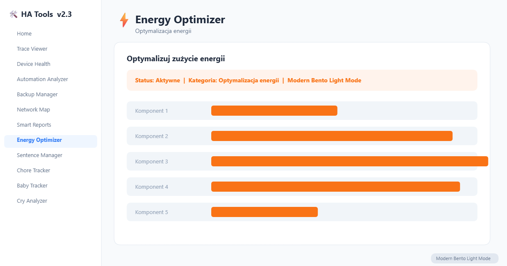

# ⚡ Energy Optimizer

Energy usage analysis and optimization card for Home Assistant. Dual-tariff aware, with Chart.js visualizations and actionable recommendations.

[](https://www.home-assistant.io/) [](LICENSE)

Part of the [HA Tools](https://github.com/MacSiem/ha-tools-panel) collection for Home Assistant.

## Screenshot



## Installation

### HACS (custom repository)

1. Open HACS in Home Assistant.
2. Go to **Frontend** → ⋮ → **Custom repositories**.
3. Add `https://github.com/MacSiem/ha-energy-optimizer` with category **Lovelace**.
4. Install **Energy Optimizer** and restart Home Assistant.

### Manual

1. Download `ha-energy-optimizer.js` from the [latest release](https://github.com/MacSiem/ha-energy-optimizer/releases).
2. Copy to `/config/www/community/ha-energy-optimizer/`.
3. Add as a Lovelace resource: `/local/community/ha-energy-optimizer/ha-energy-optimizer.js` (type: `module`).

## Usage

```yaml
type: custom:ha-energy-optimizer
# Optional settings:
title: My Energy Optimizer
energy_price: 0.65
currency: PLN
peak_rate: 0.85
off_peak_rate: 0.45
peak_hours:
  start: 6
  end: 22
```

## Privacy

- No telemetry, no analytics, no tracking.
- Chart.js is loaded from `cdn.jsdelivr.net` on first chart render (HACS-default-style dependency). Self-host if you prefer fully offline operation.
- All energy data is read from your Home Assistant entity history; nothing leaves your instance.

## Changelog

See [CHANGELOG.md](CHANGELOG.md).

## License

MIT — see [LICENSE](LICENSE).
