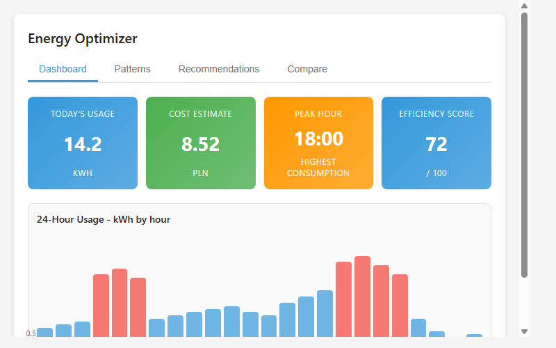
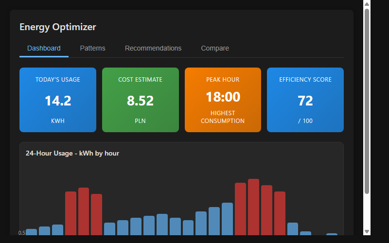

# Energy Optimizer Card for Home Assistant

A comprehensive Home Assistant custom card for monitoring and optimizing household energy consumption. Provides real-time usage analytics, peak hour tracking, cost estimation, consumption patterns, and personalized recommendations.

## Features

- **Dashboard Tab**: Real-time energy metrics including today's usage, cost estimates, peak hours, and efficiency scores
- **Patterns Tab**: Weekly heatmap visualization, 7-day trend analysis, and day-of-week comparisons
- **Recommendations Tab**: AI-driven suggestions for reducing energy consumption with estimated savings
- **Compare Tab**: Weekly and monthly consumption comparisons with cost tracking

## Installation

### Via HACS (Home Assistant Community Store)

1. Open HACS in Home Assistant
2. Click "Explore & Download Repositories"
3. Search for "Energy Optimizer"
4. Click "Download"
5. Restart Home Assistant

### Manual Installation

1. Create a directory `custom_components/energy_optimizer/` in your Home Assistant config
2. Copy `ha-energy-optimizer.js` into this directory
3. Rename the file to match your card's custom element name
4. Add to your dashboard:

```yaml
type: custom:ha-energy-optimizer
title: Energy Optimizer
currency: PLN
peak_hours:
  start: 6
  end: 22
entities:
  - sensor.energy_total
  - sensor.energy_grid
```

## Configuration

| Option | Type | Default | Description |
|--------|------|---------|-------------|
| `type` | string | Required | `custom:ha-energy-optimizer` |
| `title` | string | "Energy Optimizer" | Card title |
| `currency` | string | "PLN" | Currency code for cost display |
| `peak_hours.start` | number | 6 | Start hour of peak pricing period (0-23) |
| `peak_hours.end` | number | 22 | End hour of peak pricing period (0-23) |
| `entities` | list | Optional | Energy sensor entities to track |

## Screenshots

Light theme:


Dark theme:


## Requirements

- Home Assistant 2021.8 or later
- Browser with Shadow DOM support (all modern browsers)

## License

MIT License - Feel free to use and modify
