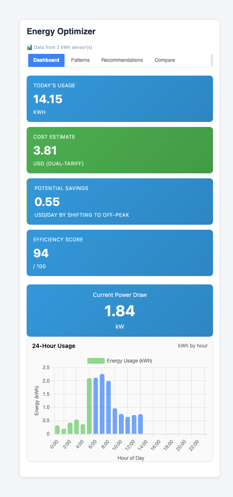
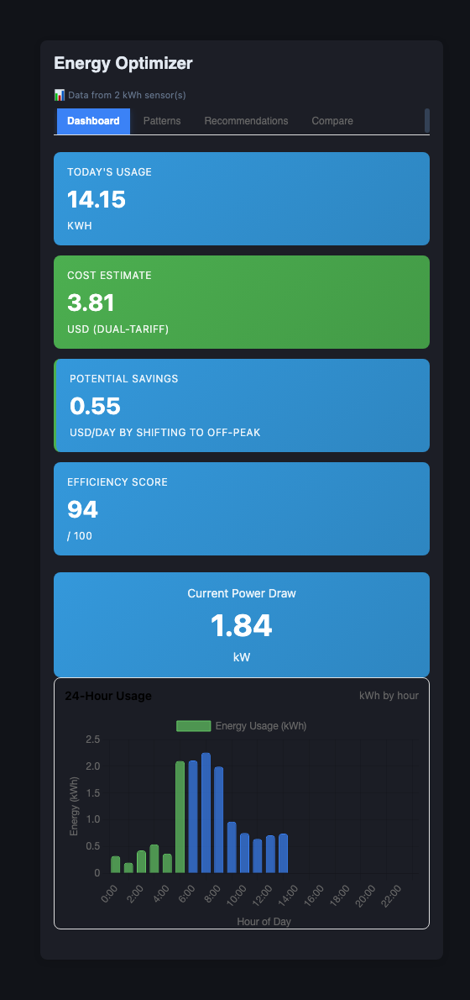

# ⚡ Energy Optimizer

Energy usage analysis and optimization card for Home Assistant. Dual-tariff
aware, with Chart.js visualizations and actionable savings recommendations —
built on your existing energy statistics, zero setup required.

[](https://github.com/MacSiem/ha-energy-optimizer/releases) [](LICENSE)

Part of the [HA Tools](https://github.com/MacSiem/ha-tools-panel) collection for Home Assistant.

## How it works

**Short version: it works automatically.** Add the card and it discovers your
energy sensors by itself — no `entities:` list to maintain.

1. **Auto-discovers kWh sensors.** On load, the card asks Home Assistant's
   recorder for every "sum" statistic (`recorder/list_statistic_ids`) and
   keeps the ones measured in kWh — your energy/grid/solar meters, whatever
   they're named.
2. **Pulls 7 days of hourly history.** It fetches hourly recorder statistics
   for those sensors (`recorder/statistics_during_period`) and aggregates
   them into today's 24-hour usage profile and a 7-day-by-24-hour dataset for
   the weekly heat map, trend and day-of-week charts.
3. **Computes cost, efficiency and savings.** Today's usage, cost estimate,
   efficiency score and the savings recommendations are all derived from that
   real data — dual-tariff aware if you set `peak_rate` / `off_peak_rate`.
4. **Current power draw** is read live from any entity with
   `device_class: power` or unit `W`.
5. **No sensors yet? No crash.** Until kWh statistics exist, the card shows
   seeded demo data labeled "⚠️ Demo data — no kWh sensors" instead of
   breaking on first install.
6. **Charts** are drawn with Chart.js, loaded from a locally-vendored copy
   first (`/local/community/ha-tools/vendor/chart.umd.min.js`) and only from
   the `cdn.jsdelivr.net` CDN if that local copy is missing.

### One repo, three cards

Since v3.3.0 this single file/repo bundles three custom elements — install
once, use any of them:

| Card type | What it adds |
|---|---|
| `custom:ha-energy-optimizer` | Dashboard, patterns (heat map/trend), recommendations and week-over-week compare — described above. |
| `custom:ha-energy-insights` | A separate 30-day breakdown across Overview / Daily / Weekly / Monthly / Tips tabs, also driven by `recorder/list_statistic_ids` + `recorder/statistics_during_period`. |
| `custom:ha-energy-email` | Sends the usage report by e-mail. Manual "Send now" always works via `ha_tools_email.send`; scheduled sends are server-side if the optional **HA Tools Email v2.0.0** integration is installed, otherwise schedule config falls back to browser `localStorage`. |

### What is automatic vs. manual

| Automatic | Manual (optional) |
|---|---|
| Discovering kWh energy sensors via recorder statistics | Nothing required to start |
| 24h usage chart, weekly heat map, trend and day-of-week charts | Setting `peak_rate` / `off_peak_rate` / `peak_hours` for accurate dual-tariff costs |
| Current power draw from any `device_class: power` / unit `W` sensor | Setting `currency` (defaults to `PLN`) |
| Cost estimate, efficiency score and savings recommendations, once real data exists | Adding `ha-energy-insights` for a 30-day breakdown, or `ha-energy-email` for scheduled reports |
| Theme (light/dark) follows your active Home Assistant theme | Self-hosting Chart.js instead of relying on the CDN fallback |

## Screenshots

| Light | Dark |
|---|---|
|  |  |

*The Dashboard tab (the default view): today's usage, cost estimate,
efficiency score, current power draw and the 24-hour usage chart. Dark mode
follows your Home Assistant theme automatically.*

## Installation

**Energy Optimizer is in the HACS default store** — no custom repository needed:

1. Open **HACS** in Home Assistant.
2. Search for **Energy Optimizer**.
3. Install and refresh your browser.

[](https://my.home-assistant.io/redirect/hacs_repository/?owner=MacSiem&repository=ha-energy-optimizer&category=plugin)

Requires Home Assistant **2024.1.0** or newer.

### Manual / custom repository

1. HACS → the **⋮** menu → **Custom repositories** → add
   `https://github.com/MacSiem/ha-energy-optimizer` as category **Dashboard**
   (Lovelace plugin) — or download `ha-energy-optimizer.js` from the
   [latest release](https://github.com/MacSiem/ha-energy-optimizer/releases).
2. Copy to `/config/www/community/ha-energy-optimizer/`.
3. Add as a Lovelace resource:
   `/local/community/ha-energy-optimizer/ha-energy-optimizer.js` (type: `module`).

## Quick start

```yaml
type: custom:ha-energy-optimizer
# Optional settings — the card works with none of these set:
title: Energy Optimizer
currency: USD
peak_rate: 0.32
off_peak_rate: 0.14
peak_hours:
  start: 6
  end: 22
```

```yaml
# 30-day breakdown, top consumers, trends:
type: custom:ha-energy-insights
```

```yaml
# Energy e-mail reports:
type: custom:ha-energy-email
```

## FAQ

**Do I have to configure anything?**
No. Add the card and it discovers your kWh energy sensors from Home
Assistant's recorder by itself. Until it finds any, it shows clearly-labeled
demo data instead of crashing.

**Why does it say "Demo data — no kWh sensors"?**
The card only found "sum" statistics that aren't measured in kWh (or none at
all). Once a sensor with `state_class: total_increasing` and unit `kWh` has
recorder history, the badge switches to "Data from N kWh sensor(s))" and the
demo numbers are replaced.

**Does it support day/night or weekday/weekend tariffs?**
Yes — set `peak_rate` and `off_peak_rate` (and optionally `peak_hours`) and
the Dashboard tab shows a "Potential Savings" tile instead of just the peak
hour.

**Does this send data anywhere?**
No telemetry or analytics. All energy figures come from your own Home
Assistant recorder/statistics — nothing leaves your instance. The only
external network request the card makes is loading the Chart.js library from
`cdn.jsdelivr.net`, and only as a fallback if a locally-vendored copy isn't
present. If you use `ha-energy-email` with the optional HA Tools Email
integration, mail is sent through the SMTP server *you* configure — not
through any MacSiem-operated service.

**What happened to the `entities:` option?**
Older stub configs mention an `entities` list, but the card never reads it —
sensors are always auto-discovered from recorder statistics, so it's safe to
leave out.

## Changelog

See [CHANGELOG.md](CHANGELOG.md).

## Support

- [Buy Me a Coffee](https://buymeacoffee.com/macsiem)
- [PayPal](https://www.paypal.com/donate/?hosted_button_id=Y967H4PLRBN8W)

## License

MIT — see [LICENSE](LICENSE).
