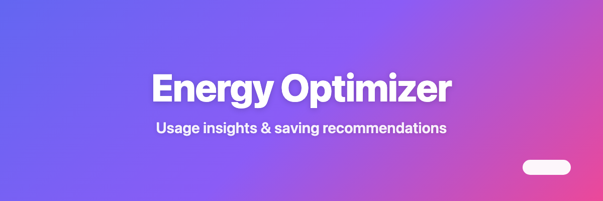
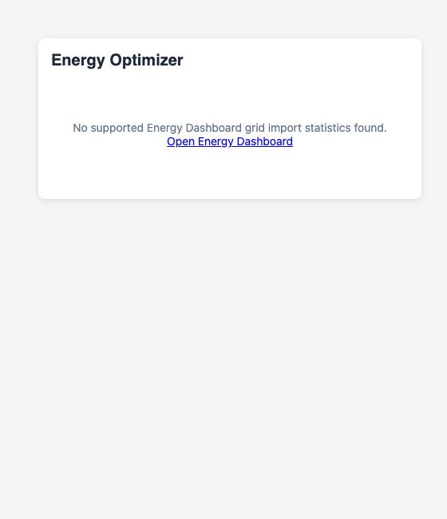
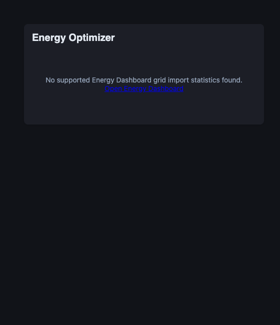

# ⚡ Energy Optimizer



Energy usage analysis for Home Assistant based on grid import configured in the Energy Dashboard. The card displays measured usage, local Chart.js charts and a tariff scenario when you provide prices. It needs Energy Dashboard grid import statistics to show numbers.

[](https://github.com/MacSiem/ha-energy-optimizer/releases) [](LICENSE)

Part of the [HA Tools](https://github.com/MacSiem/ha-tools-panel) collection for Home Assistant.

## How it works

1. All three cards read the **grid import statistics selected in your Energy Dashboard** using `energy/get_prefs`. They validate Recorder metadata and use the hourly `change` series. Solar production, grid export, power sensors in watts, and unrelated statistics are excluded.
2. Usage appears only when every configured source has every completed hourly bucket in the selected window. Missing or invalid data produces an explicit empty or error state. No demo numbers are shown.
3. Costs appear only when a tariff is configured. They are estimates based on measured import and your rate, not a bill or a measured appliance saving. The currency comes from Home Assistant unless set in the card.
4. Live power is shown only if you set `power_entity`; the card does not sum overlapping power sensors.
5. Chart.js is bundled in the single HACS JavaScript file. There is no CDN request or extra Lovelace resource.

### One repo, three cards

Since v3.3.0 this single file/repo bundles three custom elements — install
once, use any of them:

| Card type | What it adds |
|---|---|
| `custom:ha-energy-optimizer` | Dashboard, patterns (heat map/trend), recommendations and week-over-week compare — described above. |
| `custom:ha-energy-insights` | A separate 30-day breakdown across Overview / Daily / Weekly / Monthly / Tips tabs, also driven by `energy/get_prefs`, `recorder/get_statistics_metadata` and `recorder/statistics_during_period`. |
| `custom:ha-energy-email` | Recorder-backed 24h / 7d / 30d overview and report preview. Sending requires an administrator, complete data, and configured SMTP in HA Tools Email. Server previews and schedules use **HA Tools Email 2.1.2+**. Legacy direct sending also validates hourly coverage. Local schedule settings are retained but do not run a server schedule. HA Tools Email & Reports 4.5.0+ forwards to this maintained card. |

### What is automatic vs. manual

| Automatic | Manual |
|---|---|
| Grid import discovery from Energy Dashboard | Configure a grid import source in Energy Dashboard |
| Measured hourly charts when Recorder data is available | Set `energy_price` or peak/off-peak rates for cost estimates |
| Home Assistant theme and currency | Set `power_entity` for live power; add Insights or Email cards if wanted |
| Bundled charts | Configure the optional HA Tools Email integration and SMTP before sending mail |

### Windows and first run

Optimizer and Insights “Today” cover completed hourly buckets since local midnight in the Home Assistant timezone. Repeated DST hours count separately; a skipped hour is a gap, not measured zero. Weekly comparisons use consecutive 168-hour windows; monthly and email views use the last 720 hours. Email daily reports use the last 24 completed hours. The displayed start/end timestamps identify the window, so Today and a daily email can legitimately differ.

Wh, kWh and MWh are normalized to kWh. Missing sources, hours, duplicate timestamps, negative changes and unsupported metadata cannot produce a complete total. Future hours remain blank. Cost requires a configured tariff; there is no assumed electricity price.

Opening Energy Email only reads data and existing settings. It never creates helpers or automations. Explicit administrator saves use existing input_text helpers when available and browser storage otherwise. Ordinary users can read energy data; email configuration, scheduling and sending are reserved for administrators. Card tariffs are local estimates; server report costs depend on the backend’s tariff support.

## Screenshots

| Light | Dark |
|---|---|
|  |  |

*The Dashboard tab on a fresh installation without a supported Energy
Dashboard grid-import statistic. It explains how to configure a source instead
of inventing usage or cost. Dark mode follows your Home Assistant theme.*

## Installation

**Energy Optimizer is in the HACS default store** — no custom repository needed:

1. Open **HACS** in Home Assistant.
2. Search for **Energy Optimizer**.
3. Install and refresh your browser.

[](https://my.home-assistant.io/redirect/hacs_repository/?owner=MacSiem&repository=ha-energy-optimizer&category=plugin)

Requires Home Assistant **2024.1.0** or newer.

### Manual / custom repository

1. HACS → the **⋮** menu → **Custom repositories** → add
   `https://github.com/MacSiem/ha-energy-optimizer` as category **Dashboard**
   (Lovelace plugin) — or download `ha-energy-optimizer.js` from the
   [latest release](https://github.com/MacSiem/ha-energy-optimizer/releases).
2. Copy to `/config/www/community/ha-energy-optimizer/`.
3. Add as a Lovelace resource:
   `/local/community/ha-energy-optimizer/ha-energy-optimizer.js` (type: `module`).

## Quick start

```yaml
type: custom:ha-energy-optimizer
# Optional settings — the card works with none of these set:
title: Energy Optimizer
currency: USD
peak_rate: 0.32
off_peak_rate: 0.14
peak_hours:
  start: 6
  end: 22
```

```yaml
# 30-day grid-import breakdown and trends:
type: custom:ha-energy-insights
```

```yaml
# Energy e-mail reports:
type: custom:ha-energy-email
```

## FAQ

**Do I have to configure anything?**
The usage cards need at least one grid import source configured in Home Assistant's Energy Dashboard, with valid Recorder sum statistics. A tariff is optional; costs show N/A until one is configured.

**Why are usage values unavailable?**
Check the Energy Dashboard grid import source and its Recorder statistics. The card does not replace missing data with sample values.

**Does it support day/night or weekday/weekend tariffs?**
Yes. Configure the relevant rates and hours. Savings are displayed as scenarios, not promises.

**Does this send data anywhere?**
No telemetry or analytics. All energy figures come from your own Home
Assistant recorder/statistics — nothing leaves your instance. Chart.js is included in the card file; charts make no external library request. If you use `ha-energy-email` with the optional HA Tools Email
integration, mail is sent through the SMTP server *you* configure — not
through any MacSiem-operated service.

**What happened to the `entities:` option?**
Older stub configs mention an `entities` list. All cards use Energy Dashboard grid import sources instead. Legacy manual device lists and exclusions do not alter the grid-import report total.

## Changelog

See [CHANGELOG.md](CHANGELOG.md).

## Support

- [Buy Me a Coffee](https://buymeacoffee.com/macsiem)
- [PayPal](https://www.paypal.com/donate/?hosted_button_id=Y967H4PLRBN8W)

The optional support link in Energy Optimizer, Insights and Email is shown only to administrators. Dismiss it in each card or set `show_support: false` in its configuration.

## License

MIT — see [LICENSE](LICENSE).

## Privacy and data

Energy analysis reads configured Energy Dashboard sources and Recorder statistics from Home Assistant. Consumption patterns can reveal household activity. Treat exported reports and screenshots as private; use synthetic series when sharing a reproduction.

See [SECURITY.md](SECURITY.md) for safe vulnerability reporting and [NOTICE](NOTICE) for licensing notices.

### Energy Email report preview

With HA Tools Email 2.1.2 or newer, Energy Email reads the server report composer
for each cadence. Preview and sending use configured Energy Dashboard grid-import
sources and the exact completed-hour Recorder window shown in the preview.
Missing or incomplete data withholds the total; missing tariff withholds cost.
Older backends show an unavailable server preview until updated. Local period
previews never use a lifetime reading as daily, weekly or monthly consumption.

The legacy direct-send path also requires complete hourly Recorder data for the configured grid-import sources. Missing data stops period sending; measured zero remains a valid report. The exact completed-hour window is included in its email content.

## Upgrade and migration

### Updating an existing installation

Keep the existing dashboard card configuration and back up the current resource and settings before updating. Energy Optimizer, Insights and Energy Email are provided by one Energy Optimizer JavaScript resource; installing another maintained copy of the Email custom element is unnecessary.

Use HACS to update Energy Optimizer, then reload the browser. Keep the resource type `module` and ensure it points to the installed Energy Optimizer file. If an older version remains visible, inspect the installed resource and refresh its cache; do not add duplicate resources or erase settings as a troubleshooting shortcut. For a manual installation, replace the JavaScript at the existing resource path. If serving a precompressed `.gz` file, replace it together with the JavaScript so both contain the same version.

All three cards now report only the grid-import sources configured in Home Assistant's Energy Dashboard. Legacy `entities` lists, device exclusions, export and solar meters do not change the grid-import report total. Configure the source in Energy Dashboard if the cards show the missing-source guidance. Missing Recorder history stays unavailable; it is not replaced with lifetime readings or demo numbers.

Optimizer and Insights Today cover completed hourly buckets since local midnight in the Home Assistant timezone. Email daily reports use the last 24 completed hours. Weekly and monthly report windows are 168 and 720 completed hours. Compare the displayed start and end timestamps when checking values: Today and a daily email can cover different windows.

Set a tariff explicitly if cost estimates are wanted. Missing tariff or currency means unavailable cost; an explicit zero tariff is valid. Currency follows Home Assistant unless overridden in the card. A card tariff is a local estimate; backend report tariffs must be configured according to the backend's supported options.

### Email installation and report modes

The Energy card can display Recorder-backed usage without SMTP. To send reports, install HA Tools Email through HACS, add its integration under Settings → Devices & services → Add integration, then configure SMTP through that integration's Configure action. No SMTP password is stored in the Energy card configuration.

With HA Tools Email 2.1.2 or newer, administrator schedule saves use the backend and server previews use its report composer. Check the backend schedule readback before relying on automatic reports. An unavailable backend or permission error is not evidence that the integration is missing.

Legacy direct sending requires the HA Tools Email send service, a recipient and complete Recorder data for the requested window. Without the newer backend, schedule settings saved only in the browser do not run an automatic server schedule. They stay local to that browser and origin and can be lost when browser storage is cleared.

Opening the card does not create helpers or automations. Existing `input_text` helpers remain readable. Explicit administrator settings saves use an existing helper when available and fall back to browser storage when the helper is absent or the service write fails. Cross-device persistence must be verified through the actual helper/backend readback; a local save alone does not establish it. Keep existing helper names and values when upgrading.

Ordinary users can read energy data. Configuration, scheduling and sending require an administrator. Frontend controls are only one boundary: actual backend UI/API authorization and persistence must also be tested before accepting the candidate.

### Safe validation and rollback

After an update, verify all three card types, source selection, displayed periods and units; test measured zero separately from missing or incomplete data. Verify the settings readback after browser reload and Home Assistant restart using the correct storage mode. Do not send a real household email merely to test layout; use the approved local capture scenario.

If rollback is required, restore the backed-up JavaScript and matching gzip, restore the previous resource URL, and read back both served bytes and loaded UI. Preserve existing helpers, backend schedules and browser settings. A successful rollback of files alone does not prove that a cached browser has returned to the previous version.
